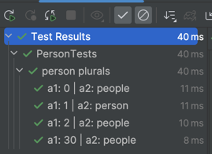

[](https://search.maven.org/search?q=com.rickbusarow.kase)
[](https://oss.sonatype.org/#nexus-search;quick~com.rickbusarow.kase)
[](https://opensource.org/licenses/Apache-2.0)

## Type-safe test parameters

Fundamentally, a `Kase` is just a generic tuple, like a `kotlin.Pair`. The key aspects are:

- It's type-safe.
- It overrides `equals()` and `hashCode()` using all its values.
- It supports destructuring declarations.
- It has a customizable `toString()` implementation, with a meaningful default.

<!--doks kase-type-safe-tuple-pair:1-->

```kotlin

val kaseA: Kase2<Int, String> = kase(3, "some string")
val kaseB/* Kase2<Int, String> */ = kase(3, "some string")
val kaseC/* Kase2<Int, String> */ = kase<Int, String>(3, "some string")

assert(kaseA == kaseB)
assert(kaseA == kaseC)
assert(kaseB == kaseC)

val (integer: Int, string: String) = kase(3, "some string")

assert(integer == 3)
assert(string == "some string")

// the default toString() is meaningful
assert(kaseA.toString() == "a1: 3 | a2: some string")

// toString() implementations can be customized at instance creation
val fancyName =
  kase(3, "some string", displayNameFactory = { "integer -> $a1, someString -> $a2" })

assert(fancyName.toString() == "integer -> 3, someString -> some string")
```

<!--doks END-->

Unlike a `Pair`, a `Kase` supports up to 22 values.

<!--doks kase-type-safe-tuple-big:1-->

```kotlin

// This may have any types, but it gets unpleasant to look at.
val bigKase: Kase22<
  Char, Char, Char, Char, Char, Char, Char, Char, Char, Char, Char,
  Char, Char, Char, Char, Char, Char, Char, Char, Char, Char, Char
  > = kase(
  'a', 'b', 'c', 'd', 'e', 'f', 'g', 'h', 'i', 'j', 'k',
  'l', 'm', 'n', 'o', 'p', 'q', 'r', 's', 't', 'u', 'v'
)
```

<!--doks END-->

<!--doks asTests-simple:1-->

```kotlin
@SampleFactory
fun `person plurals`() = listOf(
  kase(0, "people"),
  kase(1, "person"),
  kase(2, "people"),
  kase(30, "people")
).asTests { count, expected ->

  personPlural(count) shouldBe expected
}
```

<!--doks END-->



<!--doks list-multiplication-simple:1-->

```kotlin

val firstNames = kases(listOf("Bluey", "Bingo", "Chilli", "Bandit"))
val lastName = listOf(kase("Heeler"))

val names = firstNames * lastName

names shouldBe listOf(
  kase(a1 = "Bluey", a2 = "Heeler"),
  kase(a1 = "Bingo", a2 = "Heeler"),
  kase(a1 = "Chilli", a2 = "Heeler"),
  kase(a1 = "Bandit", a2 = "Heeler")
)
```

<!--doks END-->
<!--doks list-multiplication-custom-type:1-->

```kotlin
class Dog(
  val firstName: String,
  val lastName: String
) : Kase2<String, String> by kase(
  a1 = firstName,
  a2 = lastName
) {
  override val displayName: String get() = "$firstName $lastName"
  override fun toString(): String = displayName
}

val names = kases(listOf("Bluey", "Bingo", "Chilli", "Bandit"))
  .times(kases(listOf("Heeler")), ::Dog)

println(names.joinToString("\n"))
```

<!--doks END-->

## Installation

<details open>
<summary>Kotlin</summary>

<!--doks maven-with-version:1-->

```kotlin
// build.gradle.kts
dependencies {
  implementation("com.rickbusarow.kase:kase:0.5.0")
}
```

<!--doks END-->

</details>

<details>
<summary>Groovy</summary>

<!--doks maven-with-version:1-->

```groovy
// build.gradle
dependencies {
  implementation 'com.rickbusarow.kase:kase:0.5.0'
}
```

<!--doks END-->

</details>

## Contributing

If you'd like to contribute, please submit a pull request with your changes. Bug reports or
feature requests are also welcome in the issue tracker.

## License

```text
Copyright (C) 2023 Rick Busarow
Licensed under the Apache License, Version 2.0 (the "License");
you may not use this file except in compliance with the License.
You may obtain a copy of the License at
     https://www.apache.org/licenses/LICENSE-2.0
Unless required by applicable law or agreed to in writing, software
distributed under the License is distributed on an "AS IS" BASIS,
WITHOUT WARRANTIES OR CONDITIONS OF ANY KIND, either express or implied.
See the License for the specific language governing permissions and
limitations under the License.
```
